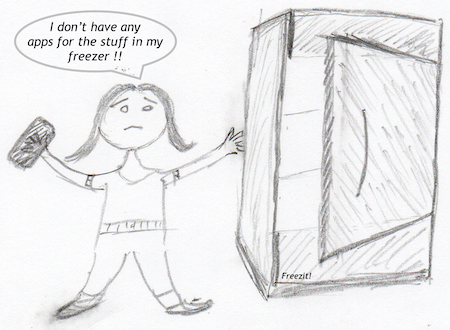

# *FREEZE-IT*
#### Video Demo:  https://youtu.be/ypI2gdEOOOk
#### Description:  iOS app to keep track of items in freezer
___

I got the basic idea for this project from a friend that complained that she did not have 
a good app on her iPhone to manage the food in her freezer. I decided to give it a try!

With my app ***FREEZE-IT*** the user can register items that are placed in the freezer. 
The registration includes a name, brand, quantity and expiration date. 
The main entry point is a collection view showing the freezers already set up. 
This screen also has some preferences menus to add brands and units of measurements used by 
the app.
The items per freezer are listed in a tableview.
From the tableview the user can *remove* (swipe), *add* and *edit* items. The *edit* and *add* option 
will direct the user to a detail screen where the user can edit the details.

The user can 
- check from the tableview if any items in the freezer are close to being overdue, 
- check from the tableview if a certain product is already in the freezer and with what quantity.
- and just in general see what is already in the freezer when shopping

When working with a project like this I have learned that it is important to say **STOP** at some point 
when ideas keep coming about new features. At first I wanted to keep adding new features as I learned 
more and more about Swift. But I had to limit myself. Otherwise all the time would be spend adding to 
the design and never actually finishing anything. 
That being said, I did several times add or change the design. I started the project with my knowledge 
of Swift being limited to what I had learned during the course videos with Pokedex, Notes and Fiftygram. 
So I had to check manuals and guides on how to use certain features and by doing so I often learned how 
I could do a previously coded routine better. That was impossible to resist! But I tried to stick to the master
plan and mainly change how features were implemented.

My overall strategy was to break down the project into smaller pieces and making sure that functionality
was working before moving on to the next piece. That strategy had for me proven beneficial when working 
with the psets of CS50 and I'm convinced that was what got me through this final project. For me Swift 
was a steep learning curve. It is unlike anything I have seen with C, Python and SQL.

For this project I started with drawing the screens and decribing high level some of the feratures I wanted 
to be included in the app. In general I tried to keep the iPhone standard like the plus icon in upper right 
corner to add new items.

Then I worked on the data model. I decided early on, that I wanted a *clean* data model without redundant
data. That meant more lookup/helper tables, for example product brand. Instead of having free text to 
enter and store product brand when registering a new item, I wanted the user to get a suggestion of similar 
previously registered brands. If the user decides for a new brand instead of one from the lookup table, this 
new brand will be stored in a helper table and the brand ID will be used in the main table for the items.

For the lookup tables (units and brands) I evaluated weither or not to link with the sql statement or load these 
tables into memory seperately and link in-code. Since I would need these helper tables anyway for lookup 
when creating new items, I decided to link these tables in-code when populating the table view for the items.

For listing and editing the lookup tables (Units and Brands) I'm using the same view. The layout of the screen is 
the same except for Units having one more element than Brands. This extra field on the screen is hidden
when the screen is used for Brands. Also some labels have different text depending on it being for a ubit or a 
brand, so those labels are also changed accordingly. But using the same view makes it easier to maintain and
ensures similar features looks the same for the user.

When calling the view for brands or units I initially created 2 segues, one from each of the buttons that selects 
weither the called view controller is used for 'units' or for 'brands'. In the "prepare for segue" I can set values 
of destination variables depending on which segue is used. I later found out that I could use just 1 segue and 
let the buttons set the value of a variable I could use in "prepare for segue". I chose to stick with my first 
approach since I could not find any recommendations for one case over the other.

When testing the app on a real iPhone I noticed that some textfields were covered by the popup keyboard. I 
found and used a guide by Axel Kee (https://fluffy.es/move-view-when-keyboard-is-shown/) that showed how 
the whole view can be moved when keyboard is present. This was not part of my original plan but was so 
useful that I simply had to implement this feature for most of the screens.

I have learned a lot during this final project and the courage and strength to engage and complete a project in 
Swift was build up during the lectures and problem sets of CS50 leading up to the final project.

**ViewController.swift**: This is the main entry point of the app and includes a collectionview of the freezers and 
a section with preferences to add/edit brands and units used by the app. This was my first hurdle to have the 
collectionview to be part of the screen instead of having the whole screen being the collectionview. A tap on a cell 
will open the ItemListView and a long pressure (hold) on a cell will open the FreezerDetailsView.

**freezeit.swift**: This contains the datamodel and the sqlite3 links to the database.

**UnitsBrandsViewController.swift**: This controller is used by both units and brands. The view is called from 
ViewController and weither it is used as screen for Units or for Brands is determined by the passing of values from 
the calling controller. If user tries to delete a unit or brand that is already used, the delete will be denied. The 
reason for this is that a delete in this case will leave some items pointing to a unit or brand that no longer exists.
When doing the testing of this view on a real device I saw that the popup keyboard covered the textfield I was 
filling. Some research brought me to a solution mentioned above to move the whole visible view and to hide the 
keyboard when done. 

**ItemListViewController.swift**: The tableview showing the items of the freezer that was tapped in previous
screen. Tapping the plus icon to add a new item will lead to the ItemView. To make this view more user friendly
to look at, I added a grey tone to the background of every second row. This was not part of my original design
but seeing the populated view with 4 labels per cell I realised that it was hard to distinguise the cells from
each other.

**ItemViewController.swift**: This view might have been the more complex to code. When saving the new or 
edited food item, the index of the unit and brand will be stored but the unit and brand description will be 
shown on screen. For selecting date, unit and brand I use a picker wheel. From the picker for unit and brand 
the user will be lead to the UnitBrandsView if the "Add new" is selected and returned to this view to complete
the registration. 

**FreezerDetailsViewController.swift**: This view is used to add and edit new freezers. A freezer can also be 
deleted from here. If a freezer contains any items the user will be warned but can decide to proceed with the 
delete.

**FreezerCell.swift**: Used for the UILabels in the collectionview cell. I later discovered that you don't need a 
separate file for this. The class for the FreezerCell can be included in same file as the class for the collectionview.
I don't know what is best practice. It seems a bit like overkill to have a new file just for a few lines of code to 
declare the variables used for the labels in the cell.

